## EV Info Display
Firmware for an EV performance information gauge using the [Waveshare ESP32-S3 2.8" touchscreen](https://www.waveshare.com/product/arduino/displays/lcd-rgb/esp32-s3-touch-lcd-2.8c.htm) development board.  It connects via the vehicle's OBD2 port.

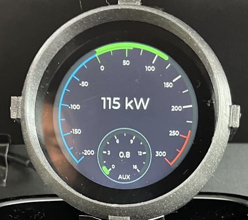

EV Info Display can show several screens showing information not typically displayed on most EV dashboards but interesting none-the-less.  Note that not all data is displayed for various supported EVs (it's based on what the vehicle can provide).

1. Speed/Torque/Elevation
2. Power consumption (kW) and Auxiliary systems power consumption
3. Traction and low-voltage battery voltage, temperature and current

In addition it contains a speed test screen allowing timing of the vehicle 0-60 MPH (0-100 KPH) performance.

Connection to the vehicle may be made via several methods.

1. Direct CAN Bus connection (using an external CAN Bus transceiver chip such as the TJA1057)
2. Wifi based ELM327 OBD2 module
3. Bluetooth low-energy (BLE) based ELM327 OBD2 module (traditional Bluetooth serial is not supported)

EV Info Display has been tested with the following ELM327 OBD2 modules.

1. LELink2 OBD-II BLE module
2. MeatPi Electronics WiCAN-PRO (Wifi only)

Currently supported vehicles include

1. VW MEB platform vehicles such as the ID.4 (RWD / AWD)
2. Nissan Leaf ZE1 (2018-2025 models)

The firmware is designed to allow easy addition of new vehicles.  Feel free to reach out to me about adding new vehicles.  You'll need the OBD2/CAN bus transactions necessary to get the various datums and a vehicle to test in.

Please look below to find instructions for easily loading pre-compiled firmware binaries onto the Waveshare board.

### Operation

EV Info Display will attempt to connect to the selected interface when powered up.  Swipe left or right between screens.  The selected screen is stored to persistent storage after 15 seconds.

#### Speed/Torque/Elevation
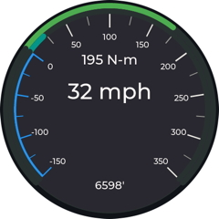

There are two arcs for AWD vehicles (outside arc is rear drive, inside arc is front drive).  Elevation is based on vehicle GPS receiver and may be off by many meters (GPS elevation is less accurate).

#### Power Consumption
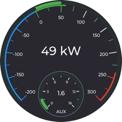

Primary display shows traction power or regeneration.

Auxiliary power consumption is vehicle-specific but usually contains low-voltage (12V) system consumption and high-voltage items such as heating/cooling and battery warming.  Depending on the vehicle auxiliary high-voltage consumers may also be reflected in the primary consumption display.

#### Electrical Information
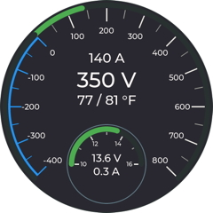

Primary display shows traction battery current with the arc display and digital readout and battery voltage and min/max pack temperatures.  Traction current is displayed as a positive number and regeneration current as a negative number.

The secondary display shows the low voltage battery voltage with the arc display and digital readout and current (charge current is positive, discharge current is negative) as well as temperature if it is available.

#### Speed Test
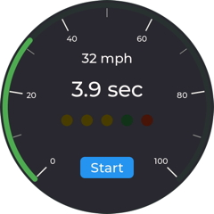

This screen allows you to time the vehicle's 0-60 MPH (0-100 KPH) performance with a fun race-track style display.  The vehicle must be stopped to initiate the test.  Pressing the ```START``` button starts the countdown timer with one LED blinking per second and set of tones.  Try to start your run just as the green LED flashes although the timer actually starts when the first non-zero speed is read.  Time timer stops when the vehicle reaches 60 MPH (100 KPH).  Jump starts or uncompleted runs result in a red LED flashing at the end.

#### Settings Screen
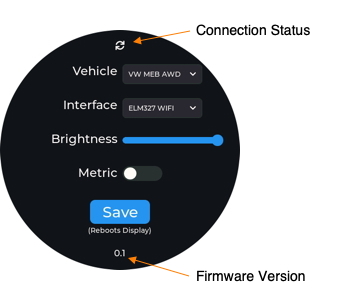

The settings screen configures display operation.

1. Connection Status is displayed when a connection has been made to the vehicle.
2. Vehicle pull-down allows selection of vehicle type.
3. Interface allows selection of the interface type.  Selecting BLE or Wifi will bring up an additional settings screen.
4. Brightness changes the backlight intensity.
5. The metric switch changes units (MPH and °F or KPH and °C).
6. Firmware version displays the current firmware revision level.

Press the Save button to commit a set of changes.  The display will reboot with the new settings in place.  Swiping away from the settings screen will cause any changes except brightness to be lost (although the new brightness level will not be saved).  This allows temporary changes of brightness without having to reboot (e.g. going from day to night).

#### BLE Setup
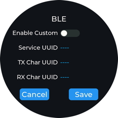

EV Info display will attempt to automatically connect to any BLE module it knows about when BLE is the selected interface.  However, the BLE setup screen allows entering a custom set of 16-bit UUIDs for any unsupported module.  Switching the Enable Custom switch on displays the Service, TX (EV Info Display to interface) and RX (interface to EV Info Display) Characteristic UUIDs. 

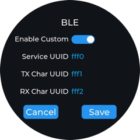

Touching a UUID displays an edit screen with keyboard.


Click ```X``` to cancel, ```√``` to set the UUID.  Then in the BLE Setup window click ```SAVE``` to store the configuration in persistent memory, CANCEL to return to the settings screen with no changes.

#### Wifi Setup
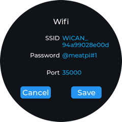

EV Info Display connects to the interface module's Wifi Access Point using a socket connection to the device's ELM327 port.  This screen configures the module SSID, optional password (leave the password blank for no password) and port number.  Clicking on any field brings up an edit screen with keyboard.

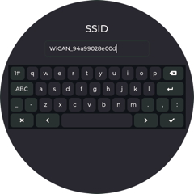

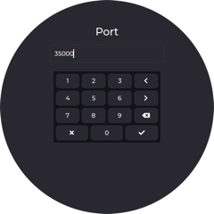

Click ```X``` to cancel, ```√``` to set the entry.  Then in the Wifi Setup window click ```SAVE``` to store the configuration in persistent memory, CANCEL to return to the settings screen with no changes.

#### Known Issues

1. Wifi and BLE connections are significantly slower than a direct CAN connection.  This is due to the overhead of managing the ELM327 interface when the vehicle uses different CAN IDs for each datum that is read.  Performance varies by vehicle type.  For example the VW MEB platform is much slower than the Nissan Leaf ZE1 platform.  The Leaf only uses a few CAN IDs while the VW MEB platform uses many more requiring a lot more communication overhead.  EV Info Display attempts to optimize configuring the ELM327 interface, only changing the necessary configuration to minimize overhead.  Best performance is always obtained using a direct CAN interface because there is no overhead.
2. I have seen, on rare occasion, the VW MEM platform stop replying to particular query items resulting in a frozen value for that item.  Powering off the car and turning it back on fixes the problem.
3. There is a bug in the Espressif IDF when using BLE.  EV Info Display will attempt to repeatedly poll for BLE devices to connect too.  However randomly the polling process will crash the ESP32 and reboot the device.  I tried to debug this but I think it's deep in some "blob" code.  During normal operation it shouldn't pose much of a problem as EV Info Display will immediately connect to the BLE interface module.

### Installation
Please see below for information about a 3D printed enclosure that can be used to hold the Waveshare board.

#### USB Power
The simplest installation occurs when using the BLE or Wifi interfaces.  Just plug the Waveshare board into a vehicle USB socket.  The vehicle will manage turning EV Info Display on and off.

You may need to remove the OBD2 module when leaving the car off for long periods of time as the OBD2 port is always powered (some modules like the WiCAN Pro can be configured to power down when the vehicle is turned off).

#### USB Power with CAN Interface breakout
Using the direct CAN bus interface requires adding a CAN Bus transceiver chip to interface the Waveshare board's ESP32-S3 internal CAN Bus interface to the CAN bus signals going to the OBD2 port.  The transceiver must be capable of operating with 3.3V logic levels for its TX and RX pins.  I found this [CAN Transceiver breakout board](https://www.amazon.com/dp/B0DXDR1ZJ6) on Amazon that works.  I also used this [OBD2 male connector](https://www.amazon.com/dp/B083FFTJGN) but there are many that will work.

1. Connect USB Power to the Native USB connector (not the Serial USB connector)
2. Connect the CAN Transceiver breakout board as shown below.  You can use the wiring harnesses that come with the Waveshare board.  Note that you'll have to create a twisted pair wire harness to the OBD2 connector.

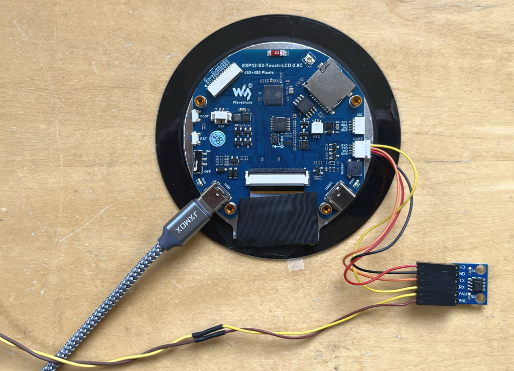

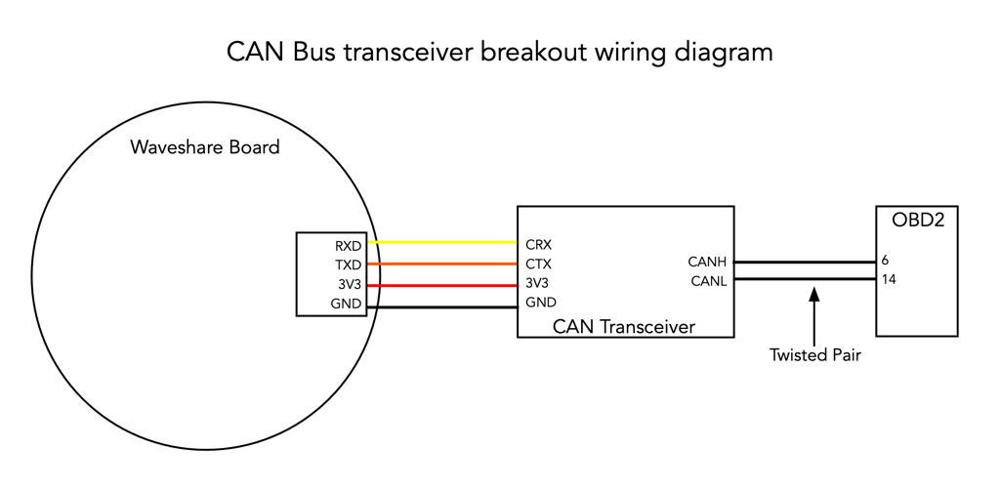

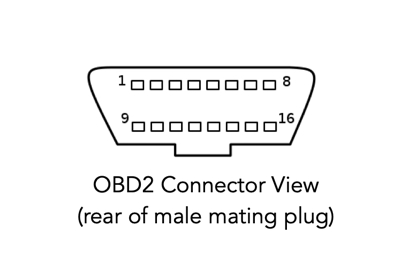

#### OBD2 Power with Switched CAN Interface board
I designed a custom open-source PCB called [Switched CAN Interface](https://github.com/danjulio/switched_can_interface) to support devices like EV Info Display.  It provides a 5V power supply that can automatically turn on when the OBD2 port voltage rises above about 13.2V (vehicle DC-DC switched on) and off when the voltage falls below 13V (vehicle DC-DC switched off).  It also includes a CAN Bus transceiver.  It is connected as shown below.

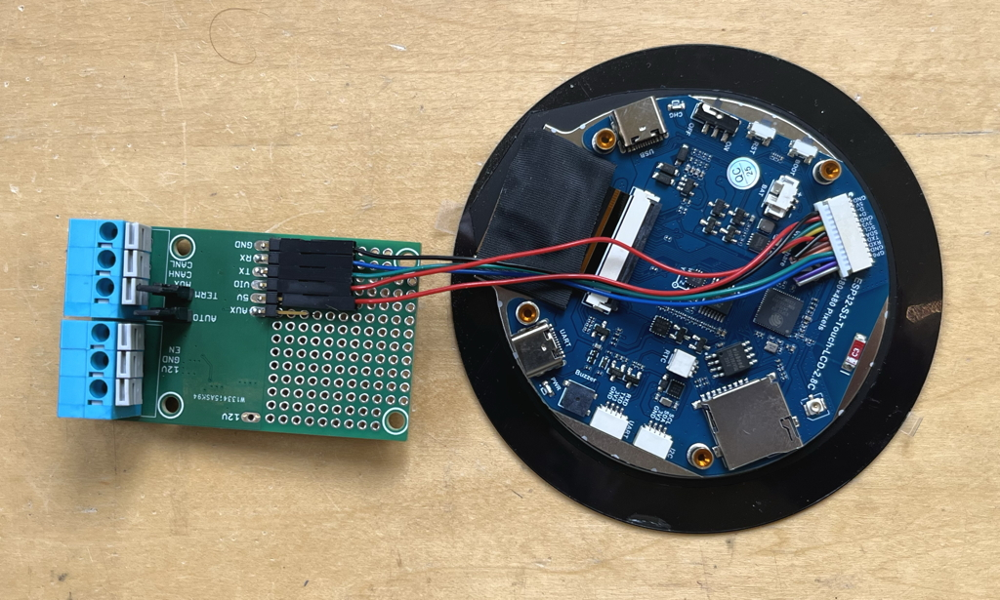

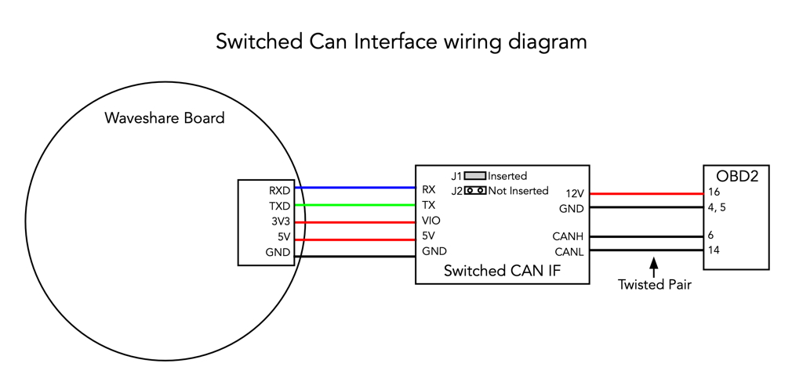

Note that the automatic switching does not work well with the Leaf because of the way the Leaf manages charging its 12V battery.  The Leaf generally quickly drops the charge voltage to about 13V after starting which will switch EV Info Display off.  Fortunately the Leaf provides a switched 12V power on the OBD connector and the Switched CAN Interface can be configured to use it as shown below.

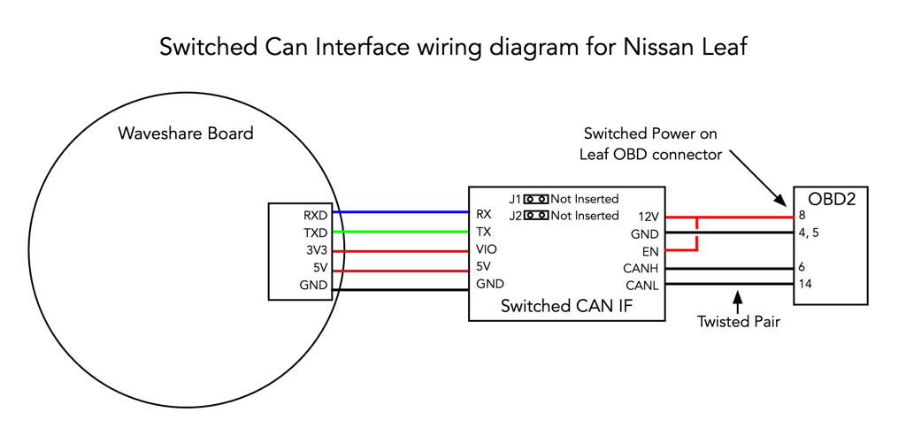

### Building the firmware
EV Info Display is built using the [Espressif IDF ](https://docs.espressif.com/projects/esp-idf/en/v5.5.1/esp32/index.html) version 5.5.1.

Assuming you have [installed](https://docs.espressif.com/projects/esp-idf/en/v5.5.1/esp32/get-started/index.html) the IDF and a local copy of this repo on your computer, change to the ```firmware``` directory and perform the following steps.

1. Execute the IDF configuration script
2. Type ```idf.py build```

The firmware binaries will be put in a created ```build``` directory.  The following binaries are programmed into the Waveshare board via one of its USB ports.

| Binary | Location | ESP32-S3 memory location to load |
|---|---|---|
| bootloader.bin | build/bootloader | 0x0000 |
| partition-table.bin | build/partition_table | 0x8000 |
| ev\_info_display.bin | build | 0x10000 |

The firmware may be loaded using the command

	idf.py -p [SERIAL_PORT] -b 921600 flash
	
where ```[SERIAL_PORT]``` is the device or device file for the serial port associated with the Waveshare board (e.g. a ```COM``` port on Windows and something like ```/dev/cu.usbmodem1101``` on Mac).

#### Log information
The firmware logs various events to the native USB Serial port.

#### Releases

| Version | Description |
|---|---|
| 0.1 | Initial Release |
| 0.2 | MEB Reverse bug fix, smoother display and minor cleanup<br>1. Add slight averaging for data when using TWAI (direct CAN) IF for smoother numeric displays (less jittery).<br> 2. Reduce number of averaged timestamps to compute largee arc change delta time intervals for smoother updates.<br> 3. Stop any ongoing arc animations on each update to prevent occasional apparent jumps in meter position.<br> 4. Detect MEB platform gear position to correctly display positive torque during reverse.<br> 5. Add untested support for Vgate iCan Pro 4.0 BLE dongle.<br> 6.  Misc code cleanup. |

### Programming pre-compiled firmware
The built binaries may be found in the ```precompiled``` directory in this repo.  There are a variety of ways to load these into the Waveshare board, including using the IDF, Espressif's Windows-only utility program or their web-browser based serial flasher described here.

The [web-browser based flasher](https://espressif.github.io/esptool-js/) requires a browser that supports hardware serial connections so Safari won't work.

Plug the waveshare board into your computer and identify what serial port it is using.  Using the UART USB serial port is safest as it will work when the flash has been erased.  Then make sure you have the three binary files loaded on your computer.

1. Press ```Connect``` under the Program header.
2. Select the appropriate serial port and click ```Connect``` on the pop-up.
3. Add the three binary files for programming at the specified locations as shown below (you'll have to ```Add file``` twice.
4. Click ```Program``` to flash the files.

Upon a successful flash you should see something like the following.

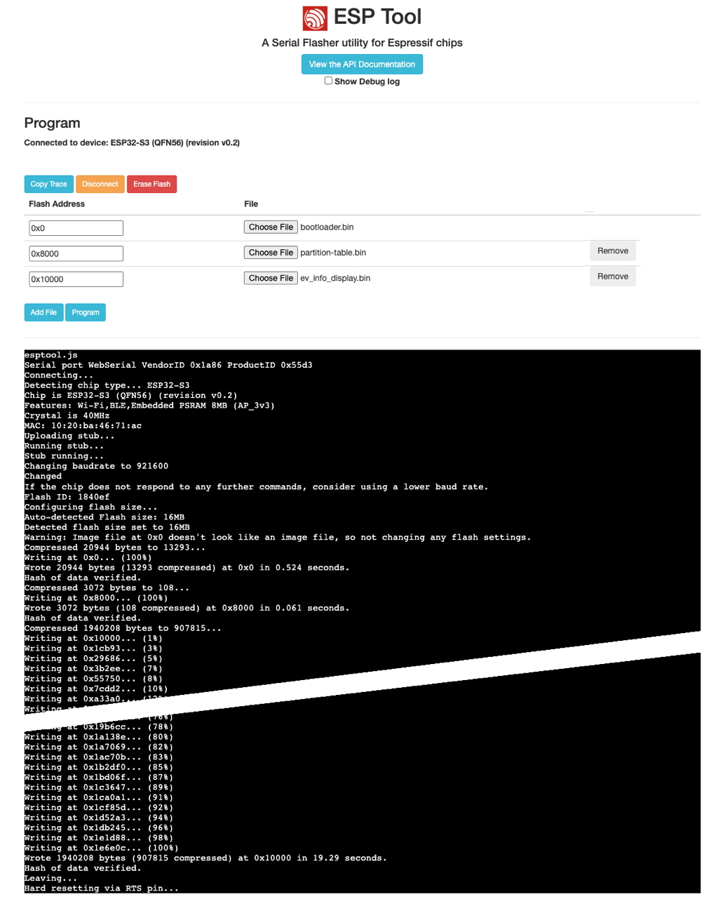

When done press the Reset button on the Waveshare board to start running the code and display the splash screen.


### Enclosures
See the ```enclosure``` directory for CAD files for a simple 3D-printed enclosure.  It can be printed in two forms.

1. Short enclosure holding only the Waveshare board.
2. Taller enclosure holding the Waveshare and Switched CAN Interface (or other CAN transceiver) boards.

#### BLE/Wifi interface enclosure
The Waveshare board in the short enclosure base with the native USB port exposed.

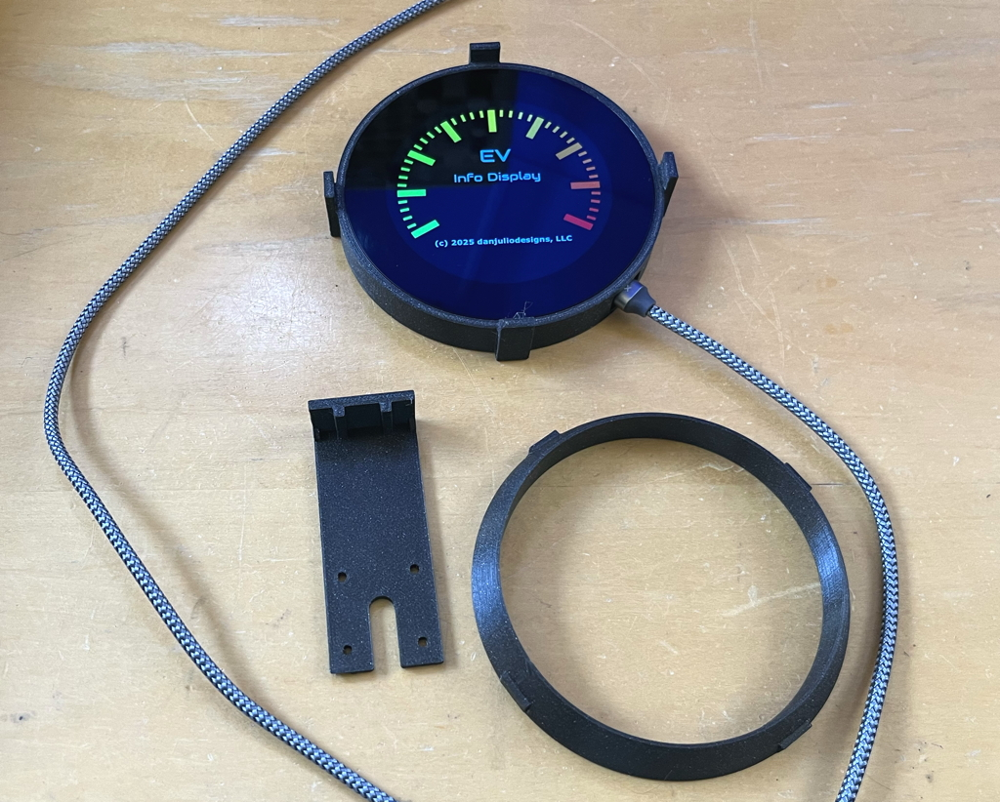

#### Switched CAN Interface board enclosure
Switched CAN Interface board mounted component-side down and the CAN+power wires run under the board, exiting via the hole in the base.  Make sure to route the wires as shown so as not to interfere with the Waveshare board sitting above.

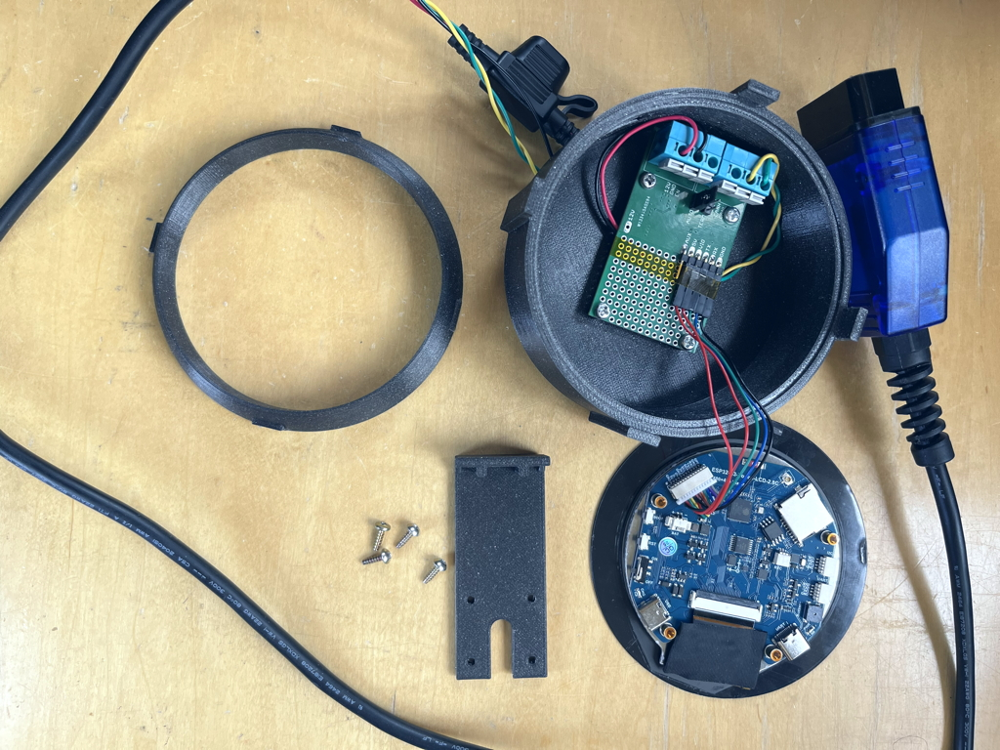

#### Assembly screws
The screws for my builds came out the screw jar but hopefully the following picture is helpful.  

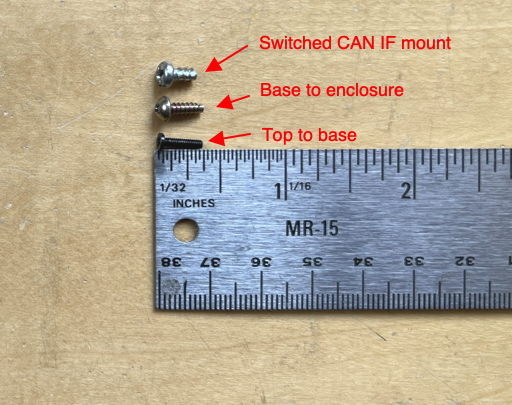

I drilled small holes through the enclosure base tab and the top piece to allow a very thin screw to hold these pieces together.

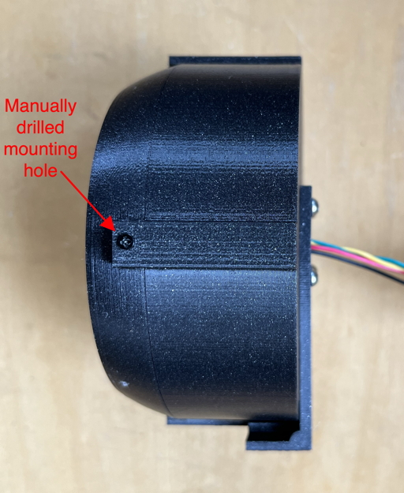
