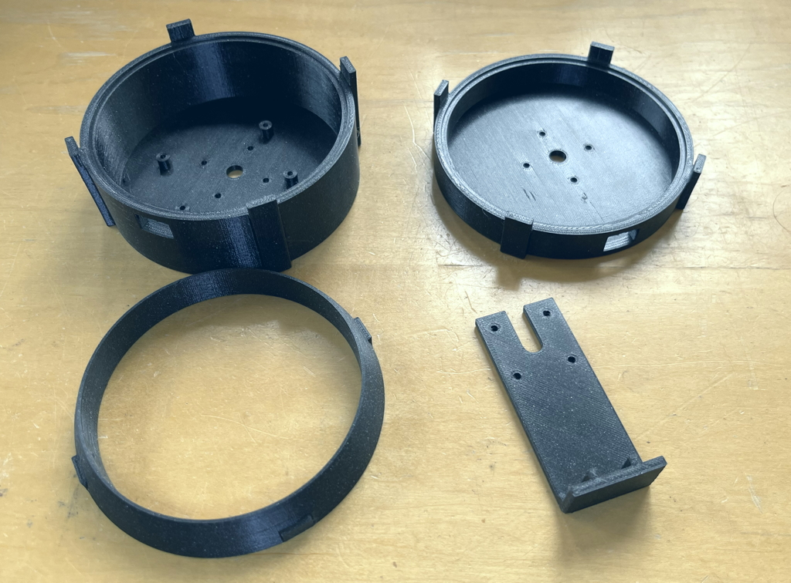
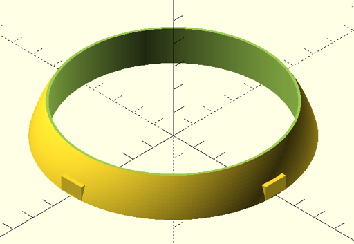
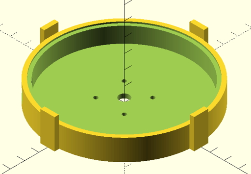
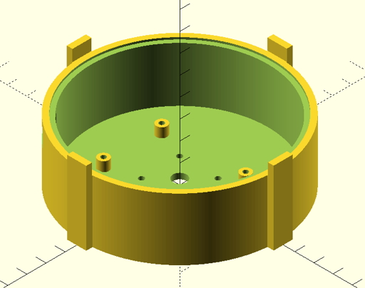
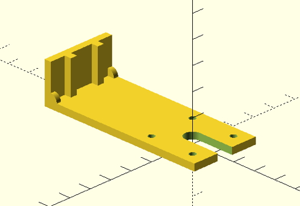
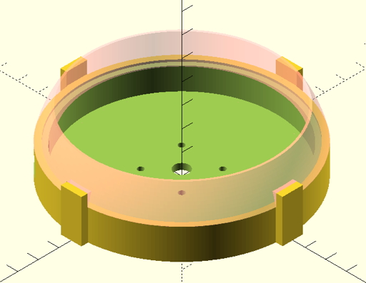
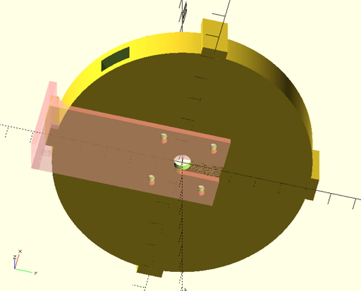

## EV Info Display Enclosure
A 3D printable enclosure for EV Info Display designed in OpenSCAD, along with STL files.  Should be printed using a high-temperature capable plastic such as PETG or ABS.  PLA will most assuredly melt on a hot day in a car.

Please note that I am NOT a mechanical engineer or 3D CAD wizard!  I know this is pretty primitive compared to what many of you can do.  But it worked for me :-)

### Components

#### Top
The top fits either base.

#### Short Base
The short base is for use when using Wifi or BLE.

#### Tall Base
The tall base is for use with Switched CAN Interface or CAN Transceiver breakout.  Wires are dressed around the PCB and exit out the hole in the bottom.

#### Mount
The mount is designed to go in any of the four possible orientations allowing mounting from any side.

#### Assembly
The Waveshare board drops into either base and then the top fits on top of that.  It will hold with a little friction or you can drill and insert very thin screws in the flanges on top of the base to hold it in place.  Orient the Waveshare board so the native USB port is accessible via the cutout (not the Serial USB port).

You can use heavy-duty double sticky tape or add screw holes to screw it into the vehicle.

